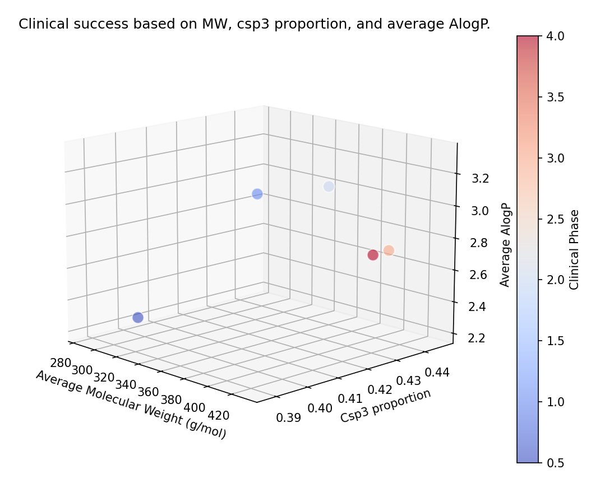
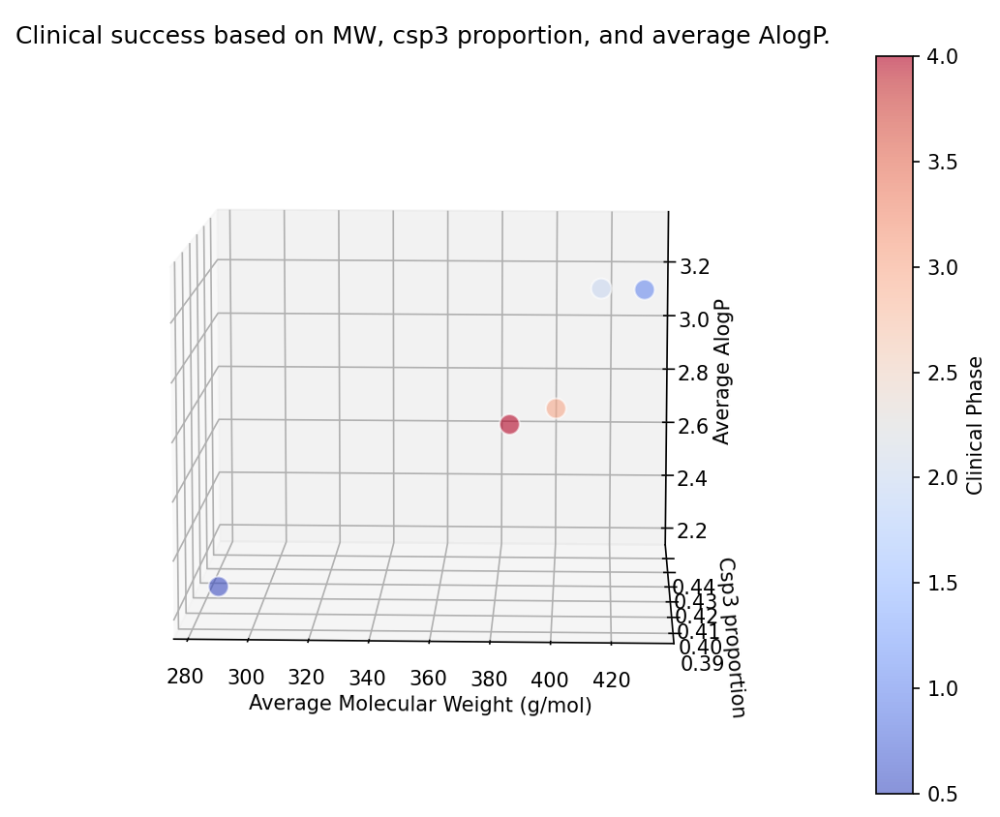

# Clinical Compound Analysis from ChEMBL
## Description
This project serves as a computational framework designed to explore the correlation between key physicochemical parameters and the clinical viability of chemical compounds. Specifically, the project delves into the impact of [molecular weight](https://en.wikipedia.org/wiki/Molecular_mass), [Csp3 proportion](https://en.wikipedia.org/wiki/Orbital_hybridisation), and [AlogP](https://en.wikipedia.org/wiki/Partition_coefficient) values on a compound's clinical success phase. Leveraging Python, the project reads raw data from a CSV file—sourced from the publicly accessible [ChEMBL database](https://www.ebi.ac.uk/chembl/) and comprising over 6,000 compounds—cleans it for analysis, and then generates a comprehensive 3D scatter plot using Matplotlib. For the chemical informatics component, the RDKit library is integrated to process and interpret the SMILES notations of the molecules.

## Introduction
Clinical success of drug candidates is not a matter of chance but rather a complex interplay of their biochemical and pharmacological properties. While the heuristic "rules" used by medicinal chemists offer some guidance, they are often far from exhaustive and occasionally elusive. Given this complexity, there is an increasing need for computational approaches that can offer quantitative insights into the features that make a molecule more likely to succeed in clinical trials. This project aims to contribute to this understanding by examining key molecular descriptors—molecular weight, Csp3 proportion, and AlogP—and how they relate to clinical success.

## Methodology
To ensure a focused and relevant dataset, I applied a series of specific filtering criteria to the raw data extracted from the ChEMBL database. The filtering was done based on the following parameters:

- *Compound Type*: Only small molecules were included in the dataset.
- *Clinical Phase*: To increase the relevance of our study, I only considered molecules that had reached specific milestones in clinical testing. Specifically, I selected compounds that were in Early Phase 1, Phase 1, Phase 2, Phase 3, or had already been approved (Phase 4).
- *Molecular Weight*: Given that molecular weight can influence a drug's pharmacokinetics and pharmacodynamics, only molecules with a weight of up to 800 g/mol were considered.

After applying these criteria, the refined list of compounds was exported from ChEMBL as a CSV file for further analysis.

## project.py
Two python files were developed for this project:

### "cleaner.py"
This script is responsible for pre-processing the raw compound data. The aim is to filter out unwanted data points and retain only the relevant molecular attributes required for further analysis.

### "plotter.py"
This script visualizes the molecular attributes of compounds, offering insights into potential correlations between a compound's molecular properties and its clinical trial phase success.

## Results
The program prints the following plot:

Based on the 3D scatter plot, the following conclusions were drawn:

1. There is a marked difference in physicochemical properties between molecules that are successful and those that are not.

2. A higher percentage of Csp3 carbons in a molecule increases its chances of reaching Phase 4 in clinical trials. This is in line with the observed in [escaping from flatland.](https://pubs.acs.org/doi/10.1021/jm901241e)

3. There seems to be an optimal range for molecular weight and AlogP values. Molecules that do not fit within these ranges are less likely to be successful.

## Conclusions
The analysis of over 6,000 compounds from the public database Chembl offers illuminating insights into the factors that may contribute to the clinical success of a molecule. It is evident that physicochemical properties like molecular weight, Csp3 proportion, and AlogP play a pivotal role in determining a molecule's progression through clinical trial phases. The 3D scatter plot distinctly shows that successful molecules often possess a higher proportion of Csp3 carbons and fall within specific ranges for molecular weight and AlogP. These insights provide not just a quantitative understanding of what drives clinical success but also offer a roadmap for the design and optimization of future compounds. This could be a critical step toward accelerating the development and adoption of more effective and sustainable drug solutions.

## Dependencies
- "csv": For reading and writing CSV files.
- "rdkit": Cheminformatics software toolkit for handling and analyzing molecular data.
- "matplotlib": For data visualization.
- "pandas": For data manipulation and analysis.

## Usage
1. Ensure all dependencies are installed.
2. Run "cleaner.py" to process your raw data.
3. Execute "plotter.py" to visualize the processed data.
